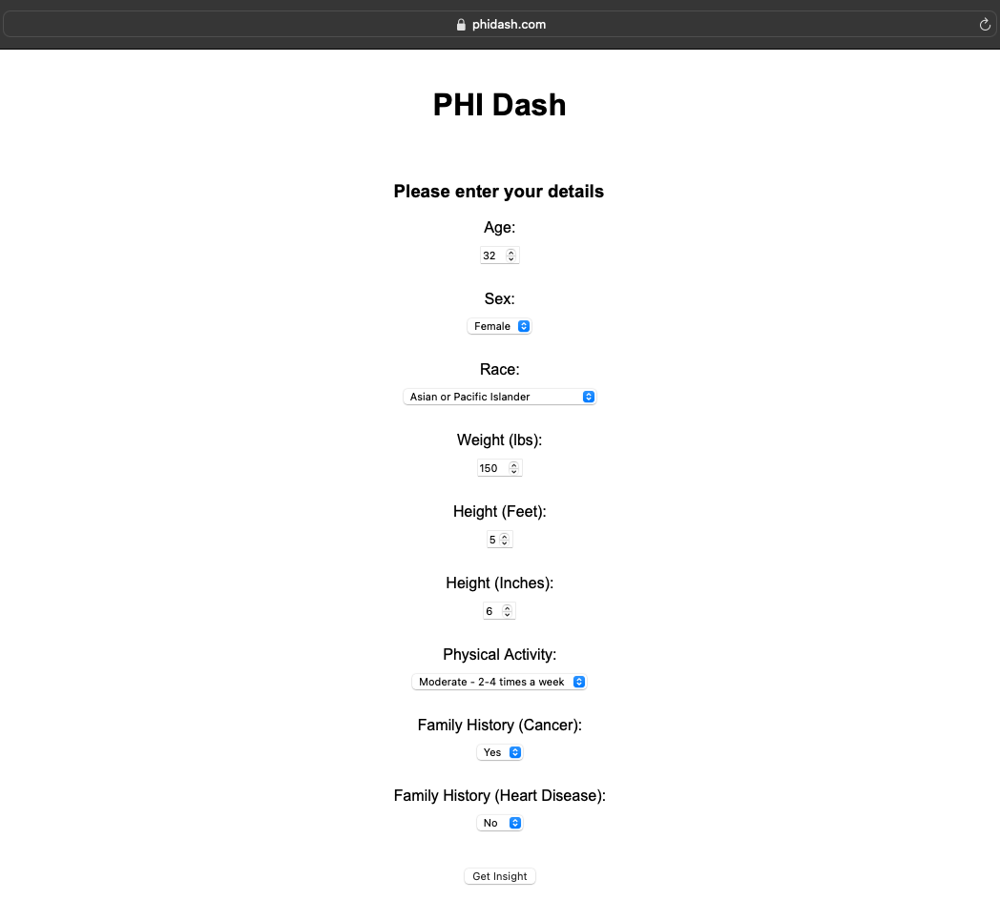
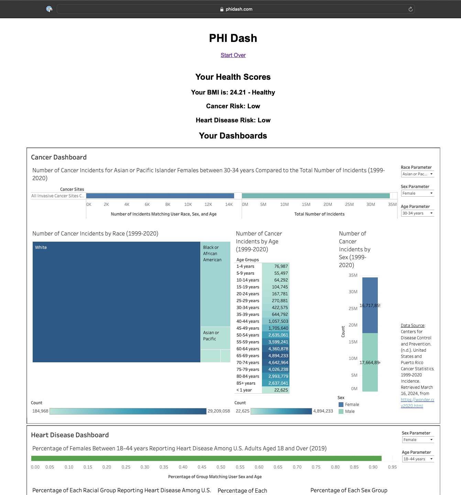

# PHI Dash
## User Manual

### Step 1: Open App
The app can be accessed via https://phidash.com

*Note: For instructions on deploying the app locally, please refer to the 'Local Deployment' section below.*

### Step 2: Complete the form

Please enter your own details, or details of the following test user: \
Age: 32\
Sex: Female\
Race: Asian or Pacific Islander\
Weight (lbs): 150\
Height (Feet): 5\
Height (Inches): 6\
Physical Activity: Moderate - 2-4 times a week\
Family History (Cancer): Yes\
Family History (Heart Disease): No\

Click on the 'Get Insight' button once form is complete

### Step 3: Observe Insights

The risk scores for the user are displayed on the top of the page.
They include:
1. The BMI with the category of Underweight, Healthy, Overweight, or Obese
2. Cancer Risk - Low, Medium or High
3. Heart Disease Risk - Low, Medium or High

Below the risk scores are the Cancer and Heart Disease Data Visualization dashboards.
In the Cancer dashboard, the user's age, sex, and race should be automatically filled as the parameters. 
The top graph should display the number of cancer incidents fitting the profile of the user for (matching age, sex, and race), compared to the total number of incidents.
The three graphs below this one show the number of incidents by race, age, and sex.

Similarly, the top graph of the Heart Disease dashboard shows the percentage of the group with the same age and sex as the user that reported heart disease in the US.
The three graphs below that one show the percentage of each racial, sex, and age group reporting heart disease in the US.

You can choose to 'Start Over' by clicking the link at the top of the page

### Local Deployment
You can deploy the app locally by following these steps:
1. Download the PHIDash folder to your local machine.
2. In your terminal, navigate to the Application folder named PHIDash_App
3. Within the PHIDash_App directory, activate the virtual environment by running "source env/bin/activate"
4. Install the required packages by running "pip install -r requirements.txt"
5. Once the packages are installed, start the application by running "node App.js", you should see the message "Server is running on port 3000."
6. Open a browser window, and go to http://localhost:3000 \
*Note: The commands are for macOS/Linux. If you're using Windows, please find and use the appropriate commands for your OS.*